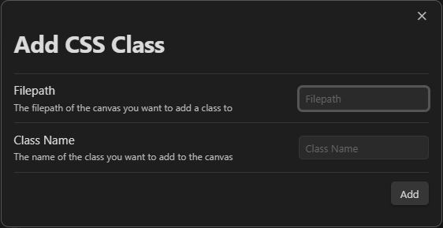
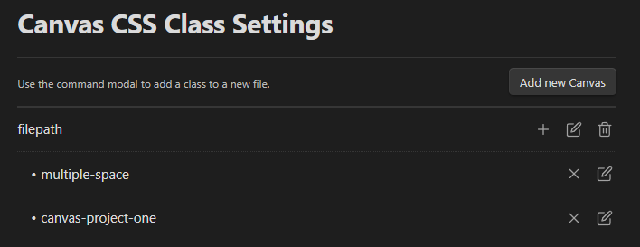

# Canvas CSS Class

This plugin do two things : 
- Add the class `.canvas-file` to the body of each canvas file, and adding the attribute `[data-canvas-path="filepath"]` 
- Allow you to add custom css class to canvas, using a modal input. Obviously, you can also remove the css-class using the plugin, with the settings or the commands modal. 

---
Yeah, that's it.

> **Note**  
> Actually, the plugin doesn't load any CSS in your canvas. You need to write your own CSS, and add it into your `.obsidian/snippets` folder.  
> Get more information about snippets [here](https://help.obsidian.md/Extending+Obsidian/CSS+snippets).

# Usage

The plugin will add two commands to the command modal :
- `Add CSS class` : Add a css class to the current canvas file
- `Remove CSS class` : Remove a css class to the current canvas file
- `Change the append mode between body & workspace` : Allow to choose the behavior of the plugin. By default, the plugin will add the css class to `.workspace-leaf.mod-active .view-content` of the canvas file. See below for more information.  
  There is 3 commands to allow changing this behavior : 
  - `quickswitch between body & view-content` : Invert the behavior of the actual canvas. 
  - `Switch to view-content mode` : Convert the actual canvas to the view-content behavior.
  - `Switch to body mode` : Convert the actual canvas to the body behavior.

You can also use the settings to add or remove a css class to the current canvas file.

Moreover, the settings allow you to add a css class for a not-opened canvas file, using the filepath of the file. It allows you to add a css class to a canvas file, even if you don't have it opened.

> **Warning**   
> If the filepath is edited (aka the file is moved or renamed), the css class will not be applied anymore. You will have to edit the filepath in the settings.

In the settings, you can also : 
- Remove all the css class 
- Remove specific css class
- Edit a css class (renaming it)
- Change the adding behavior between body & workspace

> **Note**  
> - You don't need to add the `.canvas` to the filepath. The plugin will do it for you
> - Same for class, the `.` will be added automatically when the CSS class is added.
> - And, in the same idea, space will be converted to `-` in the class name, and converted to lowercase.

## Append behavior

The plugin will add, by default, the css class to `.workspace-leaf.mod-active .view-content` of the canvas file.

This allows a better compatibility when you switch of focused file, because the css class will be conserved. 
The problem is that the css class is not conserved and exported when you export as an image. 

Changing the behavior to the `body` of Obsidian allow you to export the image conserving the css-class, but if you switch of focused file, the css class will be removed (unless you open it in a new windows!)

My advice : 
- Use a macro to switch into `body` behavior when you use the command for export as an image (you can use [Quick Add](https://github.com/chhoumann/quickadd) for that). Note : you need to add a delay, min of 30s, to allowing this to work. 
- Create a button with [commander](https://github.com/phibr0/obsidian-commander) to quick switch between the two behaviors.

> **Note**
> If you add the same class to two different file, opened in the same time, but one on the body and the other on the view-content, the class will be applied « globally », so the focusing-removing won't happen here.

---
# Installation

- Install the plugin using the community plugin manager (not yet added)
- Using [BRAT](https://github.com/TfTHacker/obsidian42-brat) using this link : `https://github.com/Lisandra-dev/obsidian-canvas-css-class`
- Manually, with unzipping the last release in your `.obsidian/plugins` folder. 

---
# :robot: Developing

You can help me to develop the plugin using npm !

- First clone the project on your computer with git clone `git@github.com:Lisandra-dev/canvas-css-class.git`
- cd `canvas-css-class`
- `npm install`
- `npm run dev` to start the developing "in live" with your Obsidian (you need to have the plugin installed in your `.obsidian/plugins`) to see the changes in live. As it can break your Obsidian Sync, I recommend you to use a test vault.)
- `npm run build` to build the plugin. 

Some notes:

- I use Conventional Commit to generate the commit message, so please respect the format!
- Don't forget to documents your function!

## 🗺️ Translation 

I use i18n to adding translation to the plugin. If you want to help me to translate the plugin, you can do it with :
- [Fork the project](https://github.com/Lisandra-dev/obsidian-canvas-css-class/fork)
- Clone the new fork on your computer or open it with Github Dev (replace the `.com` with `.dev` in the URL)
- Create a new branch, called `translation`
- Clone the file `en.ts` in the folder `plugin/i18n/locales/` and rename it with the language code (for example `fr.ts` for french)
- Translate the file
- In [the index](plugin/i18n/index.ts):
    1. Add the import using `import <language> from "./locales/<language>";`
    2. Before editing the localeMap, you need to know the exact name used by Obsidian for your language. You can find it using `<% tp.obsidian.moment.locale() %>` if you have templater, or opening the developer console (using CTRL+MAJ+I) and typing `moment.locale()`.
  3. Edit the `LocaleMap` with the language code and the name of the language. You need to have `obsidian-code-language : language` (for example `fr : french`, or for chinese `"zh-cn":cn`).

- Commit your changes and push it to your fork
- Create a new pull request to the main project

---

If you find this plugin you can give me some coffee money :  

